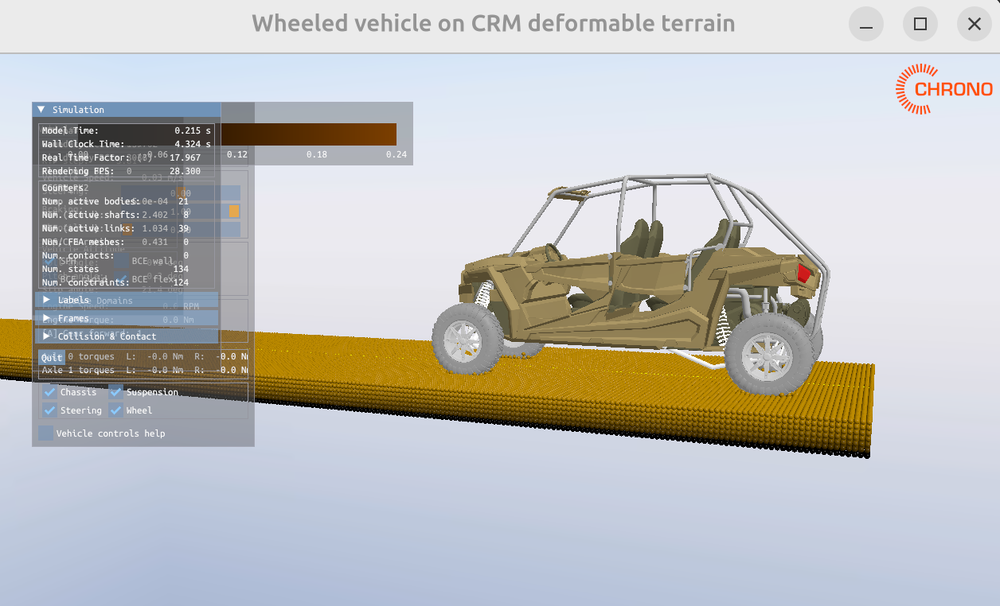

## CRM Wheeled Vehicle Tutorial

This tutorial demonstrates the simulation of a wheeled vehicle on CRM terrain using PyChrono.

### How to Run

From the `crm` folder, run:

```bash
python tutorial_VEH_CRMTerrain_WheeledVehicle.py
```

### Expected Output

Results will be saved in the `DEMO_OUTPUT/CRM_Wheeled_Vehicle/` folder. See `results.txt` for details.

