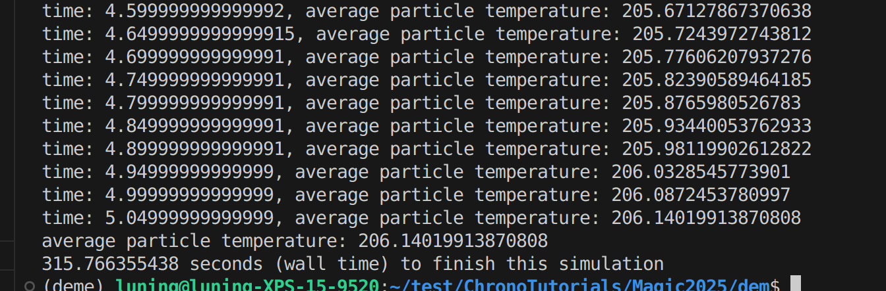
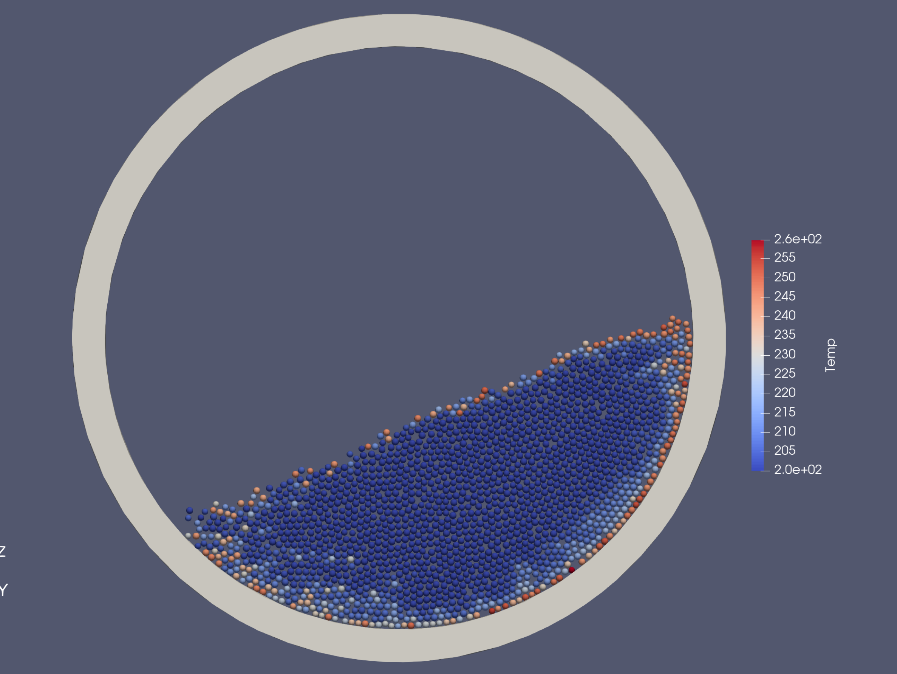

To ensure `cylinder.obj` loads properly, run the following command from within the `dem` folder:

```bash
python ./pyDEME_RotatingDrum2D.py
```

In the terminal, you should see temperature increasing at every frame. Note that, the results might be slightly different among different runs due to randomized initial particle position, however, it should be ball park similar. 

 

 A folder named `HeatTransfer` will be created, containing a series of output files that can be visualized using software such as `ParaView`:

- Files named `DEMdemo_mesh_XXXX.vtk` (where `XXXX` is a frame number) store the mesh at each output frame. 
- Files named `DEMdemo_output_XXXX.csv` contain tabular data of all the particles for each frame, such as particle position, velocity, radius, temperatures and other relevant simulation results. 


