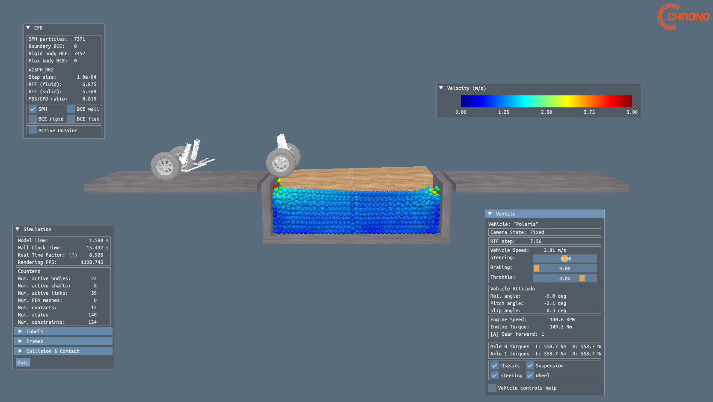

## FSI with Wheeled Vehicle Tutorial

This tutorial demonstrates the simulation of a wheeled vehicle moving across a floating block where the fluid domain is simulated with SPH.

### How to Run

From the `fsi` folder, run:

```bash
python tutorial_VEH_FSI_FloatingBlock.py
```

### Expected Output

