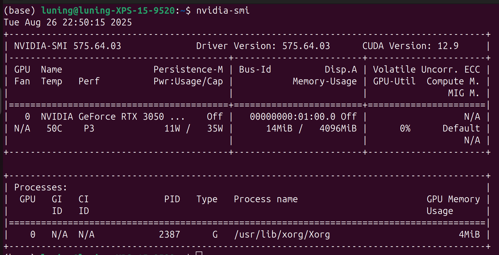

## pyChrono and pyDEME Setup Instructions

### 1. Check NVIDIA Driver

Use `nvidia-smi` to check your NVIDIA Driver version. The CUDA Version (top right) should be **12.8 or higher**. For example: 



If your driver is lower than 12.8, please upgrade your NVIDIA Driver. You can find instructions and downloads at:

- [NVIDIA Driver Downloads](https://www.nvidia.com/Download/index.aspx)
- [NVIDIA Linux Driver Installation Guide](https://docs.nvidia.com/datacenter/tesla/driver-installation-guide/index.html)

Follow the official guide for your operating system to update the driver.

### 2. Install Anaconda or Miniconda

If you haven't already done so on your machine, download and install Anaconda or Miniconda from [anaconda.com/download](https://www.anaconda.com/download).

### 3. Create and Activate Conda Environment

Run the following commands to create and activate a new conda environment (you can change `tutorial` to any name):

```bash
conda create -n tutorial "python<3.13" -c conda-forge
conda activate tutorial
```

### 4. Install Required Packages

Install PyChrono and PyDEME:

```bash
conda install bochengzou::pychrono bochengzou::pydeme -c bochengzou -c nvidia -c dlr-sc -c conda-forge
```

### 5. Running Demo Scripts

Before running any demo script, make sure your environment is activated:

```bash
conda activate tutorial
```


---

## Running pyChrono and pyDEME demos

For instructions on running the demo scripts in each tutorial, please refer to the `readme.md` file in the respective subfolders:

- `crm`
- `dem`
- `robot`
- `sensor`

Each subfolder contains specific instructions for its demo.