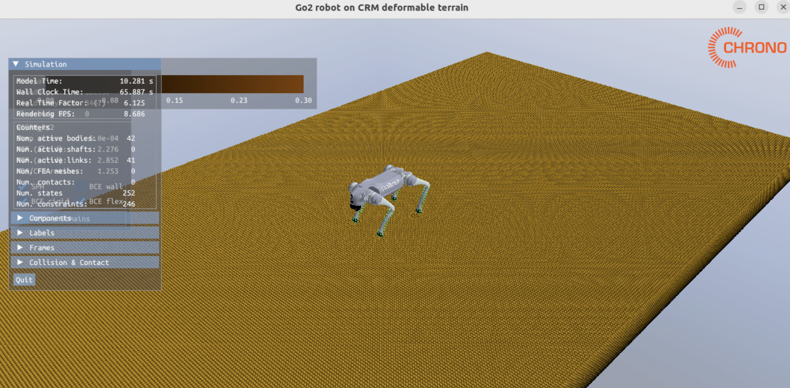

### PyChrono Installation Testing Script

After installed PyChrono, assume you are in your PyChrono conda environment, please run the following command:

1) test robot on rigid terrain
```bash
python script/playground.py
```

2) test robot on CRM granular terrain
```bash
python script/playground_crm.py
```

### Results

Result on 1 and 2 is like figure 1 and 2.


*Figure 1: Robot on rigid terrain simulation*


*Figure 2: Robot on CRM granular terrain simulation*

